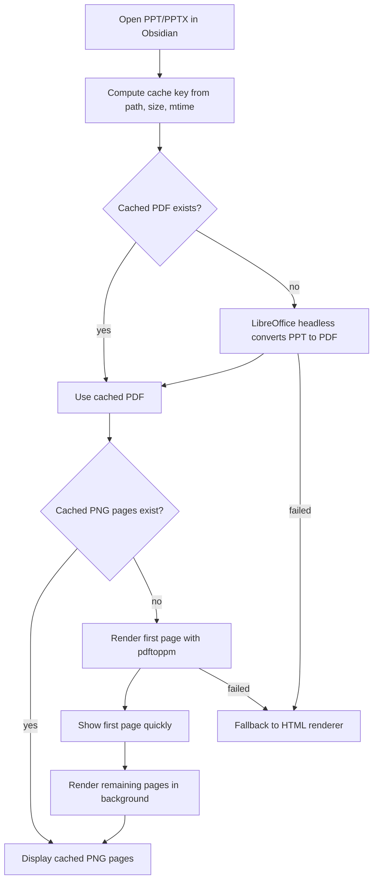

# PPT Viewer for Obsidian

[中文文档](README_ZH.md) · [GitHub](https://github.com/pherehouse/ppt-viewer)

A PowerPoint preview plugin for Obsidian, supporting `.pptx` and `.ppt`. It uses a high-fidelity **Accurate Preview** by default, with a lightweight **HTML Fallback** for simpler files or environments without native render tools.

The original PowerPoint file is never modified. PDFs and PNGs generated for Accurate Preview are stored only in the system temp cache, not in your vault. A PDF is written next to the source file only when you explicitly click **Convert PDF**.

## Features

- Open `.pptx` / `.ppt` files directly inside Obsidian.
- Prefer Accurate Preview by default for better fidelity on complex decks.
- Automatically fall back to HTML Fallback when Accurate Preview is unavailable.
- Cache rendered PDFs and PNG pages for faster repeated opens.
- Render the first page first, then render remaining pages in the background.
- Normalize rendered page numbers to avoid duplicated first pages.
- Switch from Accurate Preview to **HTML Fallback**, and return from HTML mode with the **Accurate Preview** button.
- Collapse the preview toolbar to give slides more screen space.
- Enter fullscreen preview inside Obsidian without opening PowerPoint; use arrow keys, Space, and PageUp/PageDown to move between pages.
- Open the source file with the system default app via **Open External**.
- Export a PDF beside the source file only when clicking **Convert PDF**.
- HTML Fallback supports basic text, images, shapes, tables, backgrounds, and grouped-shape transforms.

## Preview Modes

### Accurate Preview

Accurate Preview is the recommended mode. It uses a native rendering pipeline: LibreOffice headless converts the deck to PDF, Poppler `pdftoppm` renders PDF pages to PNG, and Obsidian displays the rendered page images.

Best for:

- Complex layouts, formal templates, business reports, competition decks, and roadshow materials.
- Decks with many shapes, borders, grouped objects, background images, gradients, shadows, or charts.
- Cases where visual fidelity matters more than raw parsing speed.

Limitations:

- First open requires conversion and rendering, so large decks may take a few seconds or longer.
- Requires Obsidian desktop.
- Requires LibreOffice.
- Requires Poppler `pdftoppm`.

The cache is stored in the system temp directory, for example on macOS:

```text
/var/folders/.../T/obsidian-ppt-viewer-cache/
```

### HTML Fallback

HTML Fallback reads XML directly from the `.pptx` zip package and draws slides with HTML/CSS inside Obsidian. Its goal is readable fallback, not full PowerPoint rendering fidelity.

Best for:

- Simple decks.
- Files with basic text, images, and simple shapes.
- Environments without LibreOffice or Poppler.
- Quick content inspection where exact layout is not required.

Not ideal for:

- Complex graphics, many grouped shapes, SmartArt, or complex charts.
- Pages that depend heavily on PowerPoint font metrics, auto-fit, and paragraph layout.
- Animations, special effects, complex crops, shadows, gradients, or advanced masters.

## Installation

### Manual Install

1. Download or clone this repository.
2. Create the plugin directory in your Obsidian vault:

```text
<your-vault>/.obsidian/plugins/ppt-viewer/
```

3. Copy these files into that directory:

```text
main.js
manifest.json
styles.css
```

4. Restart Obsidian, or refresh the community plugin list in settings.
5. Open `Settings -> Community plugins`.
6. Enable **PPT Viewer**.

### Optional Dependencies

Accurate Preview requires LibreOffice and Poppler. On macOS, Homebrew is recommended:

```bash
brew install --cask libreoffice
brew install poppler
```

The plugin tries these LibreOffice paths:

```text
/Applications/LibreOffice.app/Contents/MacOS/soffice
/usr/local/bin/soffice
/opt/homebrew/bin/soffice
soffice
libreoffice
```

`pdftoppm` is searched from:

```text
/opt/homebrew/bin/pdftoppm
/usr/local/bin/pdftoppm
pdftoppm
```

If these dependencies are unavailable, the plugin automatically falls back to HTML Fallback.

## Usage

After installing and enabling the plugin, click a `.pptx` or `.ppt` file in Obsidian's file explorer to open the preview.

Preview actions:

- **Accurate preview**: The current view is using Accurate Preview.
- **HTML Fallback**: Switch to the built-in HTML renderer.
- **Accurate Preview**: Return to Accurate Preview from HTML mode.
- **Hide Toolbar**: Collapse the preview toolbar for more slide space.
- **^**: A tiny top restore button shown after the toolbar is collapsed.
- **Fullscreen**: Enter fullscreen preview for the current viewer area. Use arrow keys or Space to navigate, and Esc to exit.
- **Open External**: Open the source deck with the system default app.
- **Convert PDF**: Export a PDF beside the source deck.

Note: automatically generated preview caches are not exported files. A PDF is created in the vault only after clicking **Convert PDF**.

## Tech Stack

- Obsidian Plugin API
- JavaScript
- JSZip for reading the `.pptx` zip structure
- DOMParser for PPTX XML parsing
- HTML/CSS for the lightweight fallback renderer
- LibreOffice headless for high-fidelity PPT/PPTX -> PDF rendering
- Poppler `pdftoppm` for PDF -> PNG page rendering
- Node.js APIs in Obsidian desktop: `child_process`, `fs`, `path`, `os`, `crypto`

Project files:

```text
main.js                  Bundled plugin code
manifest.json            Obsidian plugin manifest
styles.css               Plugin styles
tests/accurate-preview.test.js
tests/group-transform.test.js
tests/text-wrapping.test.js
```

## How It Works

When opening a deck, the plugin first tries Accurate Preview:



HTML Fallback:

- Unzips the PPTX package.
- Reads `ppt/presentation.xml`, slide XML, and relationships.
- Extracts slide size, backgrounds, images, shapes, text, and tables.
- Maps elements onto a fixed 16:9 canvas.
- Applies basic coordinate transforms for grouped shapes.

## Development

This repository currently does not include a full TypeScript source project. `main.js` is the directly loadable bundled plugin file. Tests are lightweight Node.js regression checks for important behavior.

Run tests:

```bash
node tests/accurate-preview.test.js
node tests/group-transform.test.js
node tests/text-wrapping.test.js
node --check main.js
```

Run these checks before publishing a release.

## Known Limitations

- HTML Fallback is not a full PowerPoint rendering engine.
- HTML Fallback does not support animations.
- HTML Fallback has limited support for SmartArt, complex charts, precise font metrics, and auto-fit text.
- Accurate Preview depends on local LibreOffice and Poppler.
- First Accurate Preview requires conversion and rendering, so large decks may take several seconds or longer.
- Caches live in the system temp directory and may be regenerated after temp cleanup.

## Troubleshooting

### Preview is slow

The first open requires LibreOffice PDF conversion and `pdftoppm` image rendering. Reopening the same file reuses cache and should be much faster.

### Accurate Preview does not show

Check that LibreOffice and Poppler are installed:

```bash
which soffice
which pdftoppm
```

On macOS:

```bash
brew install --cask libreoffice
brew install poppler
```

### HTML preview looks messy

This is expected for complex decks. Use Accurate Preview for complex PowerPoint files. HTML Fallback is only a lightweight fallback.

### First page appears twice

The plugin deduplicates rendered images by page number, avoiding duplicated first pages caused by different filenames between fast first-page rendering and full rendering. If old cache still causes a visual issue after updating, reopen the deck to refresh the view.

### I cannot return from HTML mode

HTML Fallback includes an **Accurate Preview** button in the bottom navigation, allowing you to return to the high-fidelity preview.

### I do not want generated PDFs in my vault

Automatic Accurate Preview does not create PDFs in your vault. It only uses the system temp cache. A PDF is exported beside the source deck only when clicking **Convert PDF**.

## License

Add a license before publishing this repository, for example MIT.
