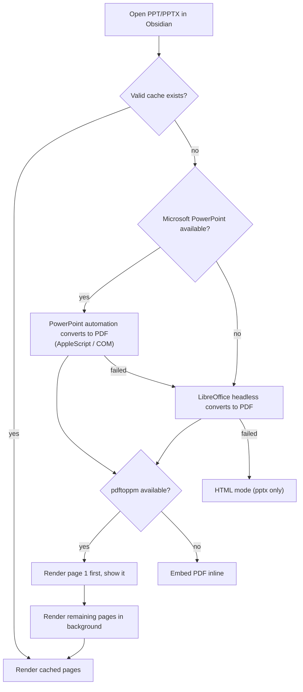

<div align="center">

# PPT Viewer

**Review PowerPoint decks inside Obsidian with native fidelity — your own PowerPoint renders the preview.**

[](./LICENSE)
[](https://obsidian.md)
[](../../releases)

[](./README.md)
[](./README_ZH.md)

</div>

PPT Viewer opens `.pptx` and `.ppt` files directly inside Obsidian. Instead of trying to re-implement PowerPoint's rendering engine, it converts the deck to PDF in the background using **Microsoft PowerPoint itself** (or LibreOffice as a fallback), renders pages to images on demand, and presents them in a clean, distraction-free review surface.

Your original files are never modified. All generated previews live in the system temp cache — nothing is written into your vault unless you explicitly export a PDF.

## Why PPT Viewer?

- You keep meeting decks, roadshow materials, and course slides in your vault, and Obsidian normally can't open them.
- HTML/CSS-based PPT renderers break on complex layouts, SmartArt, charts, and custom fonts — this plugin uses the real PowerPoint engine, so what you see is what PowerPoint shows.
- You want to **review** decks quickly (scroll, jump pages, fullscreen) without launching the full PowerPoint app every time.

## Features

### 🎯 Native-Fidelity Rendering

- **Real PowerPoint engine** — converts decks via Microsoft PowerPoint automation (AppleScript on macOS, COM on Windows) for pixel-accurate results.
- **LibreOffice fallback** — if PowerPoint is not installed, LibreOffice headless takes over automatically.
- **Legacy `.ppt` support** — old binary formats go through the same high-fidelity pipeline.
- **Smart cache with engine metadata** — caches PDF + rendered pages in the system temp directory; when PowerPoint becomes available, LibreOffice-rendered caches are upgraded automatically.

### ⚡ Fast On-Demand Preview

- **First page first** — page 1 is rendered and shown immediately, remaining pages render in the background while you read.
- **180 DPI page images** — crisp rendering via Poppler `pdftoppm`, with page deduplication.
- **Embedded PDF fallback** — if `pdftoppm` is unavailable, the converted PDF is displayed inline.
- **Instant reopen** — cached previews make subsequent opens near-instant.

### 🖥 Clean Review Surface

- **Reviewer chrome** — a minimal header with the deck name, render-engine status, and page counter that syncs as you scroll.
- **HTML mode** — a lightweight built-in JSZip/HTML renderer for `.pptx` when no native tools are available; switchable at any time.
- **Refresh** — clears the preview cache for the current file and re-renders in one click.
- **Open External** — launches the file with the system default application.
- **Export PDF** — writes a PDF next to the source file, only when you ask for it.

### 🔳 Distraction-Free Fullscreen

- **True presentation fullscreen** — the preview fills the entire screen, not just the pane.
- **Collapsible toolbar** — chrome auto-hides behind a tiny grip button; nothing else competes with your slides.
- **Keyboard navigation** — arrow keys, Space, and PageUp/PageDown flip pages; Esc exits.

## Usage

1. Install and enable the plugin (see below).
2. Click any `.pptx` / `.ppt` file in Obsidian's file explorer.
3. Wait for the first page — a "正在生成高保真预览" splash shows while the deck converts (first open only).
4. Scroll or use the keyboard to review pages.
5. Use the header buttons to switch to **HTML mode**, **refresh** the cache, enter **fullscreen**, or **open externally**.

## Install

### ① AI Install (fastest)

Paste this to your AI assistant (Claude Code / Cursor / Copilot / Trae):

```text
Help me install the Obsidian plugin "PPT Viewer":
1. Download the zip from https://github.com/pherehouse/ppt-viewer/releases/latest
2. Unzip it and place the ppt-viewer folder into <my-vault>/.obsidian/plugins/
3. Tell me how to enable it in Obsidian settings
```

Or a single curl command:

```bash
curl -fsSL https://github.com/pherehouse/ppt-viewer/releases/latest/download/ppt-viewer.zip -o /tmp/ppt-viewer.zip
unzip -o /tmp/ppt-viewer.zip -d <my-vault>/.obsidian/plugins/
```

### ② Manual Install from GitHub

1. Download `main.js`, `manifest.json`, and `styles.css` from the [latest release](../../releases/latest).
2. Create `<your-vault>/.obsidian/plugins/ppt-viewer/` and copy the files in.
3. Restart Obsidian, then enable **PPT Viewer** in `Settings → Community plugins`.

### ③ BRAT (recommended for tracking updates)

1. Install the [BRAT](https://github.com/TfTHacker/obsidian42-brat) plugin.
2. Add `pherehouse/ppt-viewer` as a beta plugin.
3. Enable **PPT Viewer** from the community plugins list.

## Requirements & Compatibility

- **Obsidian desktop** (Windows / macOS). The plugin is `isDesktopOnly` because it drives native conversion tools.
- **Best fidelity**: Microsoft PowerPoint installed
  - macOS: `/Applications/Microsoft PowerPoint.app`
  - Windows: PowerPoint via COM automation
- **Fallback**: [LibreOffice](https://www.libreoffice.org/) (`soffice`), searched in common locations such as `/Applications/LibreOffice.app/Contents/MacOS/soffice`, `/opt/homebrew/bin/soffice`, `/usr/local/bin/soffice`, and `C:\Program Files\LibreOffice\program\soffice.exe`
- **Optional, sharper pages**: [Poppler](https://poppler.freedesktop.org/) `pdftoppm` (`brew install poppler` on macOS). Without it, the converted PDF is embedded directly.
- If none of the native tools exist, `.pptx` files fall back to the built-in HTML mode; `.ppt` files require a converter.

Install the native dependencies on macOS:

```bash
brew install --cask libreoffice
brew install poppler
```

## How It Works



Cache lives in the system temp directory (e.g. `/var/folders/.../T/obsidian-ppt-reviewer-powerpoint/...` on macOS) and is keyed by source path with a cache revision and engine metadata, so caches are invalidated when the render engine or DPI changes.

## Troubleshooting

- **Preview is slow on first open** — the deck is being converted by PowerPoint/LibreOffice. Reopens use the cache and are much faster.
- **"高保真预览不可用"** — install LibreOffice (`brew install --cask libreoffice`) or PowerPoint; check `which soffice`.
- **Pages look slightly blurry** — install Poppler (`brew install poppler`) so pages render as 180 DPI PNGs instead of the embedded PDF.
- **HTML mode looks messy** — expected for complex decks; the HTML renderer is a readable fallback, not a PowerPoint clone. Switch back with the accurate-preview button.
- **Want to force a re-render** — click **刷新** (Refresh) to clear the cache for the current file.

## Credits & License

- Built on the [Obsidian Plugin API](https://docs.obsidian.md/Reference/TypeScript+API).
- HTML mode uses [JSZip](https://stuk.github.io/jszip/) for reading `.pptx` packages.
- Native rendering relies on Microsoft PowerPoint / [LibreOffice](https://www.libreoffice.org/) and [Poppler](https://poppler.freedesktop.org/).

[MIT](./LICENSE) © phere
