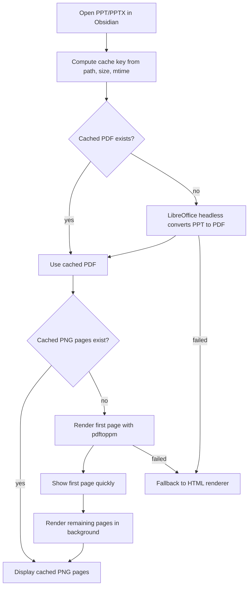

# PPT Viewer for Obsidian

[English](README.md)

在 Obsidian 中直接预览 PowerPoint 文件的插件，支持 `.pptx` 和 `.ppt`。插件默认优先使用高保真的 **Accurate Preview**，并提供轻量的 **HTML Fallback** 作为兜底。

原始 PPT 文件不会被修改。Accurate Preview 生成的 PDF/PNG 只写入系统临时缓存目录，不会出现在你的 vault 中。只有点击 **Convert PDF** 按钮时，才会主动在原文件旁边导出 PDF。

## 功能

- 在 Obsidian 内直接打开并预览 `.pptx` / `.ppt` 文件。
- 默认优先使用 Accurate Preview，复杂 PPT 更接近 PowerPoint 原始效果。
- Accurate Preview 失败时自动回退到 HTML Fallback。
- 支持 PDF/PNG 缓存，重复打开同一文件更快。
- 首屏优化：先渲染第一页，再后台渲染剩余页面。
- 已处理快速第一页与全量页面命名差异，避免第一页重复显示。
- 支持从 Accurate Preview 切换到 **HTML Fallback**，也支持从 HTML 模式点 **Accurate Preview** 返回精准预览。
- 支持折叠预览工具栏，让幻灯片占用更多空间。
- 支持在 Obsidian 内进入全屏预览，不必打开 PowerPoint 播放；全屏时可用方向键、空格、PageUp/PageDown 切换页面。
- 支持 **Open External**，用系统默认应用打开原始 PPT。
- 支持 **Convert PDF**，用户主动导出 PDF 到 vault 中原文件旁边。
- HTML Fallback 支持基础文本、图片、形状、表格、背景、组合形状坐标变换等。

## 预览模式

### Accurate Preview（精准预览）

Accurate Preview 是推荐模式。它使用本机渲染链路：先通过 LibreOffice headless 将 PPT 转成 PDF，再通过 Poppler `pdftoppm` 将 PDF 页面转成 PNG，最后在 Obsidian 中显示图片页。

适合以下场景：

- 复杂排版、正式模板、商业汇报、竞赛材料、路演文档。
- 大量形状、框线、组合对象、背景图、渐变、阴影、图表的 PPT。
- 对预览准确度要求高，而不是只想粗略看内容。

限制：

- 第一次打开需要转换和渲染，较大的 PPT 可能需要几秒或更久。
- 需要 Obsidian 桌面端。
- 需要安装 LibreOffice。
- 需要安装 Poppler 的 `pdftoppm`。

缓存目录位于系统临时目录，例如 macOS 上类似：

```text
/var/folders/.../T/obsidian-ppt-viewer-cache/
```

### HTML Fallback（HTML 兜底预览）

HTML Fallback 会直接读取 `.pptx` zip 包内的 XML，并用 HTML/CSS 在 Obsidian 中绘制幻灯片。它的目标是"可读兜底"，不是完整复刻 PowerPoint 渲染引擎。

适合：

- 简单 PPT。
- 只包含基础文本、图片、简单形状的文件。
- 没有安装 LibreOffice 或 Poppler 的环境。
- 想快速粗略查看内容。

不适合：

- 复杂图形、大量组合形状、SmartArt、复杂图表。
- 高度依赖 PowerPoint 字体度量、自动缩放、段落布局的页面。
- 动画、特殊效果、复杂裁剪、阴影、渐变、复杂母版。

## 安装

### 手动安装

1. 下载或 clone 本仓库。
2. 在 Obsidian vault 中创建插件目录：

```text
<your-vault>/.obsidian/plugins/ppt-viewer/
```

3. 将以下文件复制进去：

```text
main.js
manifest.json
styles.css
```

4. 重启 Obsidian，或在设置中刷新第三方插件列表。
5. 打开 `Settings -> Community plugins`。
6. 启用 **PPT Viewer**。

### 可选依赖

Accurate Preview 需要 LibreOffice 和 Poppler。macOS 推荐使用 Homebrew：

```bash
brew install --cask libreoffice
brew install poppler
```

插件会尝试查找这些 LibreOffice 路径：

```text
/Applications/LibreOffice.app/Contents/MacOS/soffice
/usr/local/bin/soffice
/opt/homebrew/bin/soffice
soffice
libreoffice
```

`pdftoppm` 会尝试查找：

```text
/opt/homebrew/bin/pdftoppm
/usr/local/bin/pdftoppm
pdftoppm
```

如果没有这些依赖，插件会自动回退到 HTML Fallback。

## 使用

安装并启用插件后，在 Obsidian 文件浏览器中点击 `.pptx` 或 `.ppt` 文件即可打开预览。

预览界面中的按钮说明：

- **Accurate preview**：当前处于精准预览模式。
- **HTML Fallback**：切换到内置 HTML 解析预览。
- **Accurate Preview**：在 HTML 模式中返回精准预览。
- **Hide Toolbar**：折叠预览工具栏，释放更多显示空间。
- **^**：工具栏折叠后顶部显示的小按钮，用于恢复按钮区。
- **Fullscreen**：让当前预览区域进入全屏显示；方向键/空格切换页面，Esc 退出。
- **Open External**：用系统默认应用打开原始 PPT。
- **Convert PDF**：主动导出 PDF 到原文件旁边。

注意：自动生成的预览缓存不是正式导出文件；只有点击 **Convert PDF** 才会在 vault 中生成 PDF。

## 技术栈

- Obsidian Plugin API
- JavaScript
- JSZip：读取 `.pptx` zip 包结构
- DOMParser：解析 PPTX XML
- HTML/CSS：绘制简单幻灯片 fallback
- LibreOffice headless：高保真 PPT/PPTX -> PDF 渲染
- Poppler `pdftoppm`：PDF -> PNG 页面渲染
- Node.js APIs in Obsidian desktop：`child_process`、`fs`、`path`、`os`、`crypto`

文件说明：

```text
main.js                  打包后的插件代码
manifest.json            Obsidian 插件清单
styles.css               插件样式
tests/accurate-preview.test.js
tests/group-transform.test.js
tests/text-wrapping.test.js
```

## 工作原理

打开 PPT 时，插件先尝试 Accurate Preview：



HTML Fallback 会：

- 解压 PPTX。
- 读取 `ppt/presentation.xml`、slide XML 和 relationships。
- 提取幻灯片尺寸、背景、图片、形状、文本和表格。
- 将元素映射到固定 16:9 画布中。
- 对组合形状进行基础坐标变换。

## 开发

当前仓库没有完整 TypeScript 源码工程，`main.js` 是可直接加载的 bundle。测试是轻量级 Node.js 回归测试，用于保护关键行为。

运行测试：

```bash
node tests/accurate-preview.test.js
node tests/group-transform.test.js
node tests/text-wrapping.test.js
node --check main.js
```

建议发布前至少运行以上命令。

## 已知限制

- HTML Fallback 不是完整 PowerPoint 渲染引擎。
- HTML Fallback 不支持动画。
- HTML Fallback 对 SmartArt、复杂图表、复杂字体度量、自动适配文本等支持有限。
- Accurate Preview 依赖本机 LibreOffice 和 Poppler。
- 第一次 Accurate Preview 需要转换和渲染，较大的 PPT 可能需要几秒或更久。
- 缓存位于系统临时目录，系统清理临时文件后会重新渲染。

## 故障排查

### 预览较慢

第一次打开需要 LibreOffice 转 PDF，并用 `pdftoppm` 渲染图片页。再次打开同一文件会复用缓存，速度会明显提升。

### 精准预览没有显示

确认已安装 LibreOffice 和 Poppler：

```bash
which soffice
which pdftoppm
```

macOS 可安装：

```bash
brew install --cask libreoffice
brew install poppler
```

### HTML 预览很乱

这是预期限制。复杂 PPT 应使用 Accurate Preview。HTML Fallback 只作为轻量兜底。

### 第一页重复显示

插件会按页码去重缓存图片，避免快速第一页和后台全量渲染的命名差异导致第一页重复。更新插件后如果仍看到旧缓存导致的异常，重新打开该 PPT 通常即可刷新显示。

### 从 HTML 模式回不去

HTML Fallback 底部导航中有 **Accurate Preview** 按钮，可以返回精准预览。

### 不想在 vault 中生成 PDF

自动 Accurate Preview 不会在 vault 中生成 PDF。它只使用系统临时缓存目录。只有点击 **Convert PDF** 按钮才会主动导出 PDF 到原 PPT 旁边。

## 许可证

发布前请添加许可证，例如 MIT。
