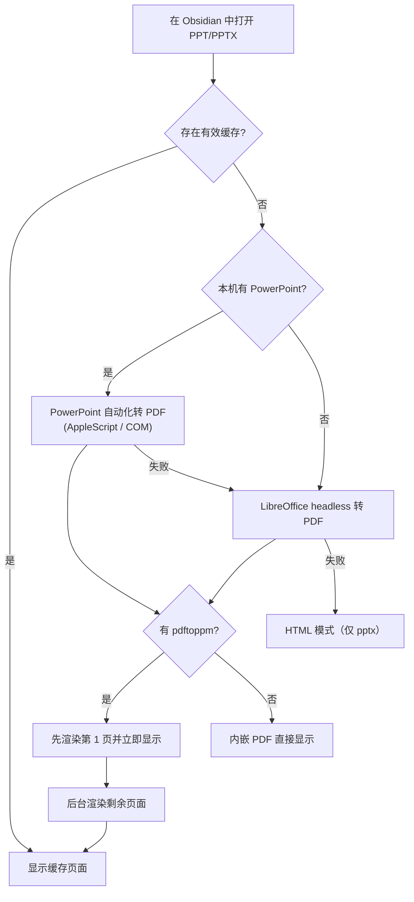

<div align="center">

# PPT Viewer

**在 Obsidian 中高保真审阅 PowerPoint —— 用你本机的 PowerPoint 渲染预览。**

[](./LICENSE)
[](https://obsidian.md)
[](../../releases)

[](./README.md)
[](./README_ZH.md)

</div>

PPT Viewer 让你在 Obsidian 中直接打开 `.pptx` 和 `.ppt` 文件。它不再尝试用 HTML/CSS 重新实现 PowerPoint 的渲染引擎，而是在后台调用**本机 Microsoft PowerPoint**（或 LibreOffice 兜底）把幻灯片转成 PDF，按需渲染成图片，并在一个简洁、无干扰的审阅界面中呈现。

原始文件永远不会被修改。所有自动生成的预览只写入系统临时缓存目录 —— 除非你主动导出，否则 vault 中不会多出任何文件。

## 为什么需要 PPT Viewer？

- 会议汇报、路演材料、课程课件都放在 vault 里，而 Obsidian 原生打不开它们。
- 基于 HTML/CSS 的 PPT 渲染器在复杂排版、SmartArt、图表、自定义字体上经常失真 —— 本插件直接用真正的 PowerPoint 引擎渲染，所见即 PowerPoint 所得。
- 你想快速**审阅**幻灯片（滚动、跳页、全屏），而不是每次都启动完整的 PowerPoint 应用。

## 功能

### 🎯 高保真渲染

- **真实 PowerPoint 引擎** — 通过 Microsoft PowerPoint 自动化转换（macOS 用 AppleScript，Windows 用 COM），像素级还原。
- **LibreOffice 兜底** — 未安装 PowerPoint 时自动切换到 LibreOffice headless。
- **支持旧版 `.ppt`** — 老的二进制格式同样走高保真流水线。
- **带引擎元数据的智能缓存** — PDF 和渲染页缓存在系统临时目录；一旦装上 PowerPoint，LibreOffice 渲染的旧缓存会自动升级重渲。

### ⚡ 按需快速预览

- **首屏优先** — 第 1 页先渲染先显示，其余页面在后台边看边渲。
- **180 DPI 页面图片** — 通过 Poppler `pdftoppm` 渲染清晰页面，并做页码去重。
- **内嵌 PDF 兜底** — 没有安装 `pdftoppm` 时直接内嵌显示转换后的 PDF。
- **重复打开秒开** — 命中缓存后几乎无需等待。

### 🖥 简洁审阅界面

- **审阅 chrome** — 极简顶栏显示文件名、渲染引擎状态和页码，滚动时页码自动同步。
- **HTML 模式** — 内置轻量 JSZip/HTML 渲染器，在没有任何本机工具时兜底显示 `.pptx`，可随时切换。
- **刷新** — 一键清除当前文件的预览缓存并重新渲染。
- **外部打开** — 用系统默认应用打开原始文件。
- **导出 PDF** — 仅在你主动点击时才在原文件旁生成 PDF。

### 🔳 无干扰全屏

- **真·演示全屏** — 预览铺满整个屏幕，而不只是一个面板。
- **可折叠工具栏** — chrome 收起后只留一个小把手按钮，屏幕上只剩幻灯片。
- **键盘翻页** — 方向键、空格、PageUp/PageDown 翻页，Esc 退出。

## 使用

1. 安装并启用插件（见下方安装方式）。
2. 在 Obsidian 文件浏览器中点击任意 `.pptx` / `.ppt` 文件。
3. 等待第一页出现 —— 首次打开会显示"正在生成高保真预览"过渡画面（仅第一次）。
4. 滚动或使用键盘审阅页面。
5. 通过顶栏按钮切换 **HTML 模式**、**刷新**缓存、进入**全屏**或**外部打开**。

## 安装

### ① AI 安装（最快）

把下面这段话直接粘给 AI 助手（Claude Code / Cursor / Copilot / Trae）：

```text
帮我安装 Obsidian 插件 "PPT Viewer"：
1. 从 https://github.com/pherehouse/ppt-viewer/releases/latest 下载 zip
2. 解压后把 ppt-viewer 文件夹放到 <我的仓库>/.obsidian/plugins/ 目录下
3. 告诉我如何在 Obsidian 设置里启用它
```

或一条 curl 命令直装：

```bash
curl -fsSL https://github.com/pherehouse/ppt-viewer/releases/latest/download/ppt-viewer.zip -o /tmp/ppt-viewer.zip
unzip -o /tmp/ppt-viewer.zip -d <我的仓库>/.obsidian/plugins/
```

### ② 从 GitHub 手动安装

1. 从 [最新 release](../../releases/latest) 下载 `main.js`、`manifest.json` 和 `styles.css`。
2. 在 vault 中创建 `<你的仓库>/.obsidian/plugins/ppt-viewer/` 目录并放入这三个文件。
3. 重启 Obsidian，在 `设置 → 第三方插件` 中启用 **PPT Viewer**。

### ③ BRAT（推荐用于跟踪更新）

1. 安装 [BRAT](https://github.com/TfTHacker/obsidian42-brat) 插件。
2. 添加 `pherehouse/ppt-viewer` 作为 beta 插件。
3. 在第三方插件列表中启用 **PPT Viewer**。

## 环境要求与兼容性

- **Obsidian 桌面端**（Windows / macOS）。因为要驱动本机转换工具，插件为 `isDesktopOnly`。
- **最佳保真**：安装 Microsoft PowerPoint
  - macOS：`/Applications/Microsoft PowerPoint.app`
  - Windows：通过 COM 自动化调用 PowerPoint
- **兜底**：[LibreOffice](https://www.libreoffice.org/)（`soffice`），自动探测常见路径，如 `/Applications/LibreOffice.app/Contents/MacOS/soffice`、`/opt/homebrew/bin/soffice`、`/usr/local/bin/soffice`、`C:\Program Files\LibreOffice\program\soffice.exe`
- **可选（页面更清晰）**：[Poppler](https://poppler.freedesktop.org/) `pdftoppm`（macOS 用 `brew install poppler`）。没有它时会直接内嵌 PDF 显示。
- 如果本机工具都没有：`.pptx` 会回退到内置 HTML 模式；`.ppt` 必须要有转换器。

macOS 安装本机依赖：

```bash
brew install --cask libreoffice
brew install poppler
```

## 工作原理



缓存位于系统临时目录（macOS 上类似 `/var/folders/.../T/obsidian-ppt-reviewer-powerpoint/...`），按源文件路径加缓存版本号和引擎元数据作为键 —— 渲染引擎或 DPI 变化时缓存会自动失效重建。

## 故障排查

- **首次打开较慢** — 正在由 PowerPoint/LibreOffice 转换，再次打开会命中缓存，明显变快。
- **提示"高保真预览不可用"** — 安装 LibreOffice（`brew install --cask libreoffice`）或 PowerPoint；可用 `which soffice` 检查。
- **页面略模糊** — 安装 Poppler（`brew install poppler`），页面会以 180 DPI PNG 渲染，替代内嵌 PDF。
- **HTML 模式排版乱** — 复杂 PPT 的预期表现，HTML 渲染器只是可读兜底，不是 PowerPoint 复刻。可点高保真按钮切回。
- **想强制重新渲染** — 点击**刷新**按钮，清掉当前文件缓存重渲。

## 致谢与许可

- 基于 [Obsidian Plugin API](https://docs.obsidian.md/Reference/TypeScript+API) 构建。
- HTML 模式使用 [JSZip](https://stuk.github.io/jszip/) 读取 `.pptx` 包。
- 本机渲染依赖 Microsoft PowerPoint / [LibreOffice](https://www.libreoffice.org/) 与 [Poppler](https://poppler.freedesktop.org/)。

[MIT](./LICENSE) © phere
